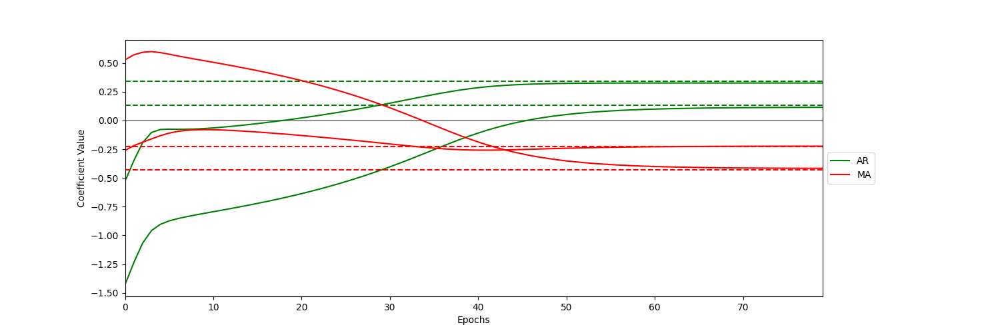

# ARMA cell: PyTorch implementation

This repo contains the PyTorch implementation of the ARMA cell, a neural network cell designed to model time series using a modular and simpler approach compared to traditional Recurrent Neural Network (RNN) cells like Long Short-Term Memory (LSTM) cells. It builds on the autoregressive moving average (ARMA) model, a classical statistical tool for time series analysis.     
The methodology is described in detail in the paper Schiele, P., Berninger, C., & Rügamer, D. (2024). [ARMA Cell: A Modular and Effective Approach for Neural Autoregressive Modeling](https://arxiv.org/abs/2402.08987). preprint arXiv:2208.14919v2. The official implementation of the ARMA cell in TensorFlow can be found at the [armacell_paper](https://github.com/phschiele/armacell_paper) repository. Additionally, data and code to reproduce the experiments in the original paper can be found at the [armacell_paper](https://github.com/phschiele/armacell_paper) repository.

## Repository contents

T

## Getting started

The ARMA cell can be used similarly to other PyTorch modules.The syntax of the PyTorch implementation of the ARMA cell is similiar to the Tensorflow  one. Where `q` is the number of MA lags, wheras the number of AR lags is already represented in the preprocessed data, which is handled by `prepare_arma_input`.

Below is an example using the functional model API

```python
x = ARMA(q, input_dim=(n_features, p), units=1, activation="relu", use_bias=True)(x)
 ```


## Comparison with TensorFlow implementation

In this implementation  both ArmaCell and ARMA inherit from the PyTorch nn.Module class. This allows for easy integration into existing PyTorch models and facilitates the use of standard training and evaluation procedures. This also means that the ARMA class implementts its own forward method manually applying the ARMA cell to each time step, in contrast to the TensorFlow implementation. where most of the logic is handled by the `tf.keras.layers.RNN` wrapper.

erences in the implementation due to the distinct design philosophies of these frameworks.

## Comparison between TensorFlow and PyTorch Implementations


The most fundamental difference lies in the class inheritance structure. In the TensorFlow implementation, `ArmaCell` extends `AbstractRNNCell`, and `ARMA` extends `RNN`, leveraging TensorFlow's built-in recurrent neural network infrastructure. Conversely, the PyTorch version  both `ArmaCell` and `ARMA` inherit from the PyTorch nn.Module class, this allows for easy integration into existing PyTorch models and facilitates the use of standard training and evaluation procedures. This also means that the ARMA class implementts its own forward method manually applying the ARMA cell to each time step, in contrast to the TensorFlow implementation. where most of the logic is handled by the `tf.keras.layers.RNN` wrapper.

Parameter initialization also differs between the two implementations. TensorFlow utilizes `self.add_weight()` within the `build()` method, while PyTorch employs `nn.Parameter()` in the `__init__()` method. 

State management is handled differently as well. In the TensorFlow version, the `RNN` parent class takes care of state management automatically. The PyTorch implementation, however, requires manual state management within the `ARMA` class's `forward()` method, offering more explicit control but also demanding more detailed coding.

Activation functions and tensor operations also showcase the frameworks' distinct APIs. TensorFlow uses `tf.keras.activations.deserialize()` for activation functions and operations like `tf.concat` and `tf.expand_dims` for tensor manipulation. PyTorch, on the other hand, retrieves activation functions using `getattr(F, activation)` from `torch.nn.functional` and employs operations such as `torch.cat` and `unsqueeze` for tensor operations.

### Implications

These differences reflect the distinct approaches of TensorFlow and PyTorch

- TensorFlow provides more built-in infrastructure for RNNs, potentially simplifying implementation but with less flexibility.
- PyTorch offers a more explicit, "from-scratch" approach, providing greater control over the implementation details.

Both approaches have their merits, and the choice between them often depends on specific project requirements and personal preference.


## Minimum working example
```python
import torch
from torch import nn, optim
from arma_torch import ARMA
from plotting_torch import plot_convergence
from helpers_torch import (simulate_arma_process, prepare_arma_input, set_all_seeds, SaveWeights)
from statsmodels.tsa.arima.model import ARIMA
import numpy as np


# 1. Obtain time series data. Simulating an ARMA process here for simplicity

arparams = np.array([0.1, 0.3])
maparams = np.array([-0.4, -0.2])
alpha = 0
set_all_seeds()


#  Generate data

y = simulate_arma_process(arparams, maparams, alpha, n_steps=25000, std=2)

# 2. Data pre-processing.
# In practice, p and q are hyperparameters. Here, we use the true values.
p, q = len(arparams), len(maparams)
X_train, y_train = prepare_arma_input(max(p, q), y)


# 3. Train and Fitthe model
def get_trained_ARMA_p_q_model(q, X_train, y_train, units, add_intercept=False, plot_training=False, **kwargs):
    input_dim = (X_train.shape[-2], X_train.shape[-1])
    # Assuming input_dim should be (batch_size, time_steps)
    model = ARMA(q=q, input_dim=input_dim, units=units, use_bias=add_intercept, **kwargs)
    criterion = nn.MSELoss()
    optimizer = optim.Adam(model.parameters(), lr=0.001)

    X_train = torch.tensor(X_train, dtype=torch.float32)
    y_train = torch.tensor(y_train, dtype=torch.float32).squeeze()

    weights_saver = SaveWeights()

    epochs = 80
    batch_size = 100
    for epoch in range(epochs):
        model.train()
        epoch_loss = 0
        for i in range(0, len(X_train), batch_size):
            X_batch = X_train[i:i+batch_size]
            y_batch = y_train[i:i+batch_size]

            optimizer.zero_grad()
            state = torch.zeros((X_batch.size(0), model.arma_cell.state_size[0], model.arma_cell.state_size[1]))
            outputs, state = model(X_batch, state)
            outputs = outputs.squeeze(-1)
            loss = criterion(outputs, y_batch)
            loss.backward()
            
            # Gradient clipping
            torch.nn.utils.clip_grad_norm_(model.parameters(), max_norm=1.0)
            
            optimizer.step()
            epoch_loss += loss.item()

        if plot_training:
            weights_saver.on_epoch_end(model, epoch)
        print(f'Epoch {epoch+1}/{epochs}, Loss: {epoch_loss/len(X_train)}')

    return model, weights_saver.weights_history

model, weights_history = get_trained_ARMA_p_q_model(q, X_train, y_train, units=1, add_intercept=False, plot_training=True)


# 4. Fit a classical ARMA model for comparison
arma_model = ARIMA(endog=y, order=(p, 0, q), trend="n").fit()

# 5. Plot the result
plot_convergence(weights_history, p, add_intercept=False, arima_model=arma_model, path="image.png")
```

Looking at the convergence plot, similiarly to the TensorFlow implementation, the ARMA cell converged to the true parameters at least as good as a classical ARIMA model. Depending on the seed used more or less epochs might be needed.




## Test
Unit and regression tests are handled through `pytest`, which can be installed via `pip install pytest`.
To run all tests, simply execute
```shell
pytest
```
from the root of the repository.


## Acknowledgments
We wish to express our gratitude to prof Rügamer and dr Schiele for providing guidance and support. 


## License
See [`LICENSE.md`](LICENSE.md) for details.


